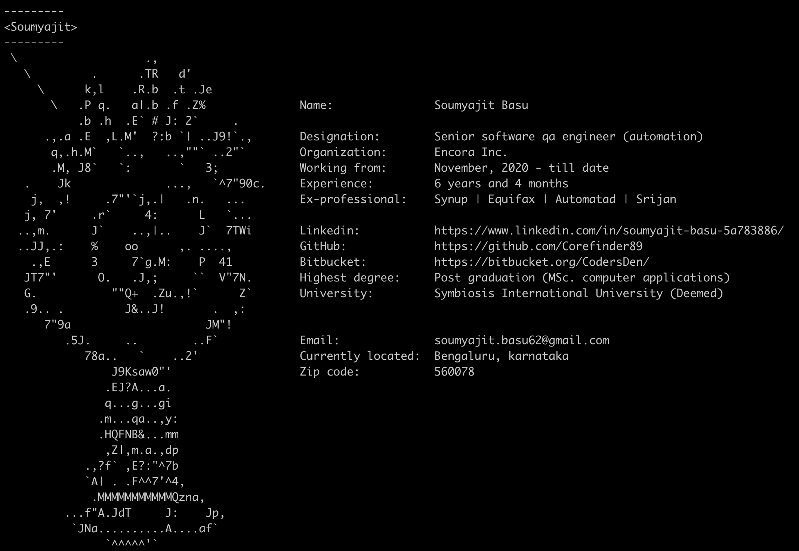

# My Digital Business card

Creating a digital business card for myself so that it can be used to give my digital information over the internet.
Developed in python. The card would look like this:

To see my digital profile just run the command:

`pip install --user corefinder`

To get help run this command:

`corefinder --help`

To get version run this command:

`corefinder --version`
