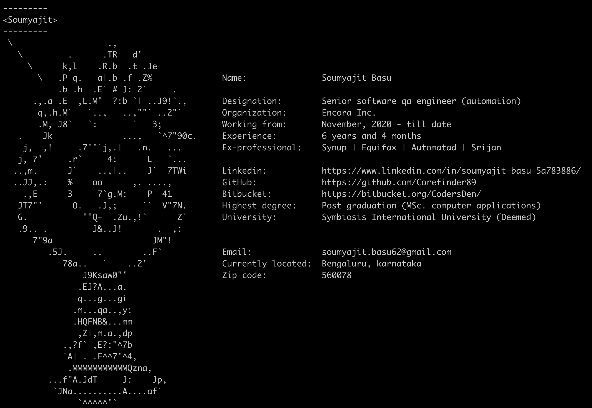

# Corefinder - Interactive Digital Business Card 🎨

[](https://python.org)
[](https://opensource.org/licenses/MIT)
[](https://pypi.org/project/corefinder/)

A sophisticated Python CLI application that generates a beautiful ASCII art digital business card with interactive URL shortening and clickable hyperlinks.



## 🌟 Key Features

### ✨ Interactive Elements
- **Smart URL Shortening**: Automatically converts long URLs to `cf.link` branded short links
- **Terminal Hyperlinks**: URLs are clickable in modern terminals while showing branded domains
- **Progress Bar Interface**: Professional countdown display with real-time server status
- **Background HTTP Server**: Seamless redirect handling for shortened URLs

### 🔧 Technical Excellence
- **Zero External Dependencies**: Uses only Python standard library
- **Cross-Platform**: Works on Windows, macOS, and Linux
- **Thread-Safe**: Concurrent URL shortening with SQLite backend
- **Production Ready**: Professional error handling and graceful degradation

## 🚀 Quick Start

### Install from PyPI (Recommended)
```bash
pip install --user corefinder
corefinder
```

### Development Installation
```bash
git clone https://github.com/Corefinder89/corefinder.git
cd corefinder
pip install --use-feature=in-tree-build .
corefinder
```

### Direct Execution
```bash
python -m app
```

## 💻 CLI Commands

```bash
corefinder                    # Display interactive business card
corefinder --daemon          # Run with persistent server
corefinder --version         # Show version information  
corefinder --help           # Display help
```

## 🏗️ Architecture Overview

### Core Components

```
corefinder/
├── app/
│   ├── main.py              # CLI & application orchestration
│   ├── card.py              # ASCII art generator
│   └── url_shortener.py     # HTTP server & URL management
├── tests/                   # Test suite
│   ├── debug_shortener.py   # URL shortener debugging
│   ├── test_redirect.py     # HTTP redirect testing
│   └── test_main.py         # Main application tests
└── documentation/           # Technical documentation
```

### URL Shortening System Architecture

The URL shortener creates professional branded links while maintaining full functionality through three core components:

1. **SQLite Database Storage** (`url_shortener.db`)
2. **HTTP Redirect Server** (runs on localhost:8888+)
3. **Terminal Hyperlink Generation**

## 🔧 How URL Shortening Works

### Smart URL Mapping Process

```python
# 1. Original URL
original_url = "https://www.linkedin.com/in/soumyajit-basu/"

# 2. Generate unique short code
short_code = "a3Kx9P"  # 6-character alphanumeric (62^6 combinations)

# 3. Store in SQLite database
CREATE TABLE urls (
    id INTEGER PRIMARY KEY,
    original_url TEXT NOT NULL,
    short_code TEXT NOT NULL UNIQUE
)

# 4. Create terminal hyperlink
display_url = "http://cf.link/a3Kx9P"        # What user sees
working_url = "http://localhost:8888/a3Kx9P"  # Actual redirect URL
```

### Terminal Hyperlinks with ANSI Escape Sequences

Creates clickable links using ANSI escape sequences:
```python
f"\033]8;;{working_url}\033\\{display_url}\033]8;;\033\\"
```

**Result**: User sees branded `cf.link/a3Kx9P` but clicks open the original LinkedIn URL.

### HTTP Redirect Flow

1. **User clicks**: Terminal displays `cf.link/a3Kx9P`
2. **Terminal opens**: `localhost:8888/a3Kx9P`
3. **Server extracts**: Short code `a3Kx9P`
4. **Database lookup**: Returns original LinkedIn URL
5. **HTTP 302 redirect**: Browser opens original destination
6. **Final result**: User reaches LinkedIn profile

### Automatic Port Management

- **Primary port**: 8888
- **Fallback ports**: 8889, 8890, 9000-9002
- **Intelligent selection**: Automatically finds available port

## 🛠️ Development Setup

### Prerequisites
- Python 3.6+
- pip package manager

### Local Development
```bash
git clone https://github.com/Corefinder89/corefinder.git
cd corefinder

# Set up virtual environment
python -m venv .venv
source .venv/bin/activate  # macOS/Linux
# .venv\Scripts\activate   # Windows

# Install in development mode
pip install -e .

# Run application
python -m app
```

### Building for Distribution

#### Using Makefile (Unix/Linux/macOS)
```bash
make clean      # Clean previous builds
make build      # Build package
make publish    # Publish to PyPI
```

#### Manual Build (All Platforms)
```bash
# Clean previous builds
rm -rf build/ dist/ *.egg-info/

# Build package
python -m pip install --upgrade build
python -m build

# Publish to PyPI
python -m twine upload dist/*
```

### Development Workflow
```bash
# 1. Make changes to code
# 2. Test quickly
python -m app

# 3. Rebuild package
pip install -e . --force-reinstall

# 4. Test CLI
corefinder
```

## 🌟 Advanced Features

### Terminal Compatibility

✅ **Supported Terminals:**
- Windows Terminal
- VS Code Terminal  
- iTerm2 (macOS)
- GNOME Terminal

❌ **Unsupported Terminals:**
- Old Windows Command Prompt
- Basic terminal emulators

**Fallback**: Shows display text as regular text in unsupported terminals.

### Server Operation Modes

- **Standard Mode**: 60-second runtime with progress visualization
- **Daemon Mode**: Persistent server for continuous operation

### Database Features
- **Thread-safe**: SQLite with concurrent access handling
- **Collision prevention**: Automatic uniqueness checking for short codes
- **Scalability**: Handles millions of URL records efficiently

## 📊 Performance Characteristics

- **Memory**: ~5-10MB typical usage
- **CPU**: Minimal (I/O bound operations)
- **Storage**: SQLite database scales with URL count
- **Network**: Single port HTTP server with fallback
- **Thread Safety**: Full thread-safe implementation

## 🧪 Testing

```bash
# Run all tests
python -m pytest tests/

# Debug URL shortener specifically
python tests/debug_shortener.py

# Test HTTP redirects
python tests/test_redirect.py

# Test main application
python tests/test_main.py
```

## 🐛 Troubleshooting

### Common Issues

**Module not found errors:**
```bash
pip install --use-feature=in-tree-build . --force-reinstall
```

**Server port conflicts:**
- URL shortener automatically tries alternative ports (8888-9002)

**Changes not reflected:**
```bash
pip install --use-feature=in-tree-build . --force-reinstall
corefinder
```

**Unicode/encoding errors during installation:**
```python
# Ensure setup.py reads files with UTF-8 encoding
with open('README.md', encoding='utf-8') as f:
    long_description = f.read()
```

## 🤝 Contributing

### Development Process
1. Fork the repository
2. Create feature branch: `git checkout -b feature/amazing-feature`
3. Commit changes: `git commit -m 'Add amazing feature'`
4. Push to branch: `git push origin feature/amazing-feature`
5. Open Pull Request

### Code Standards
- Follow PEP 8 style guidelines
- Add tests for new functionality
- Update documentation for API changes
- Use type hints where appropriate

### Testing Requirements
- All tests must pass
- New features require corresponding tests
- Maintain or improve code coverage

## 🚀 Future Enhancements

### Planned Features
- [ ] Custom domain configuration
- [ ] URL analytics and click tracking
- [ ] RESTful API for programmatic access
- [ ] Web interface for URL management
- [ ] Theme customization for ASCII art

### Technical Improvements
- [ ] Async HTTP server for better performance
- [ ] Configuration file support
- [ ] Plugin system for extensibility
- [ ] Docker containerization

## 📞 Contact & Support

- **Author**: Soumyajit Basu (@Corefinder89)
- **GitHub**: [github.com/Corefinder89](https://github.com/Corefinder89)
- **Email**: soumyajit.basu62@gmail.com
- **LinkedIn**: [soumyajit-basu-5a783886](https://www.linkedin.com/in/soumyajit-basu-5a783886/)

### Support Channels
- **Issues**: [GitHub Issues](https://github.com/Corefinder89/corefinder/issues)
- **Discussions**: [GitHub Discussions](https://github.com/Corefinder89/corefinder/discussions)

## 📄 License

This project is licensed under the MIT License - see the [LICENSE](LICENSE) file for details.

## 📝 Changelog

### Version 1.2.7 (2025-10-02)
- ✨ Added Smart URL Shortening with cf.link branding
- 🔗 Terminal Hyperlinks for clickable URLs in modern terminals
- 📊 Progress Bar Interface with real-time countdown
- 🔄 Daemon Mode for persistent server operation
- 🌐 HTTP Server with automatic port fallback
- 📚 Enhanced Documentation with architecture overview

### Version 1.1.7
- 🎨 Initial ASCII art business card display
- 💻 Basic CLI interface with help and version flags
- 📋 Personal and professional information display

## 🌟 Show Your Support

If you find this project useful:
- ⭐ Star the repository
- 🐛 Report bugs or issues
- 💡 Suggest new features
- 🤝 Contribute to the codebase
- 📢 Share with others

---

*Made with ❤️ by [Soumyajit Basu](https://github.com/Corefinder89)*
