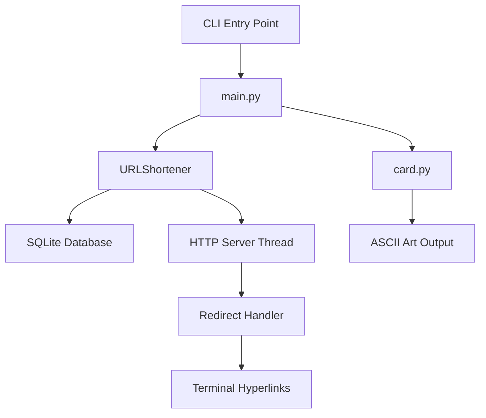

# Corefinder - Interactive Digital Business Card 🎨

[](https://python.org)
[](https://opensource.org/licenses/MIT)
[](https://pypi.org/project/corefinder/)

A sophisticated Python CLI application that generates a beautiful ASCII art digital business card with interactive URL shortening and clickable hyperlinks.


## � Key Features

### ✨ Interactive Elements
- **Smart URL Shortening**: Automatically converts long URLs to cf.link branded short links
- **Terminal Hyperlinks**: URLs are clickable in modern terminals while showing branded domains
- **Progress Bar Interface**: Professional countdown display with real-time server status
- **Background HTTP Server**: Seamless redirect handling for shortened URLs

### 🎨 Visual Excellence
- **ASCII Art Display**: Stunning terminal-based business card layout
- **Professional Formatting**: Clean, readable information presentation
- **Modern CLI Interface**: Intuitive command-line interaction

### 🔧 Technical Excellence
- **Zero External Dependencies**: Uses only Python standard library
- **Cross-Platform**: Works on Windows, macOS, and Linux
- **Thread-Safe**: Concurrent URL shortening with SQLite backend
- **Production Ready**: Professional error handling and graceful degradation

## 📋 Project Overview

| Attribute | Details |
|-----------|---------|
| **Type** | Python CLI Package with HTTP Server |
| **Version** | 1.2.7 |
| **Author** | Soumyajit Basu (@Corefinder89) |
| **License** | MIT |
| **Python** | 3.6+ |
| **Dependencies** | None (Standard Library Only) |

## 🚀 Quick Start

### Option 1: Install from PyPI (Recommended)
```bash
pip install --user corefinder
corefinder
```

### Option 2: Development Installation
```bash
git clone https://github.com/Corefinder89/corefinder.git
cd corefinder
pip install -e .
corefinder
```

### Option 3: Direct Execution
```bash
git clone https://github.com/Corefinder89/corefinder.git
cd corefinder
python -m app
```

## 💻 CLI Commands

```bash
# Display interactive business card
corefinder

# Run with persistent server (daemon mode)
corefinder --daemon

# Show version information
corefinder --version

# Display help information
corefinder --help
```

## 🏗️ Architecture Overview

### Core Components

```
corefinder/
├── 📱 app/                          # Main application package
│   ├── __init__.py                  # Package initialization
│   ├── __main__.py                  # Module entry point
│   ├── main.py                      # Application orchestration & CLI
│   ├── card.py                      # ASCII art generator
│   └── url_shortener.py             # HTTP server & URL management
├── 🧪 tests/                        # Test suite
│   ├── debug_shortener.py           # URL shortener debugging
│   ├── simple_test.py               # Basic functionality tests
│   ├── test_main.py                 # Main application tests
│   └── test_redirect.py             # HTTP redirect testing
├── 🖼️ image/                        # Assets
│   └── calvin.png                   # Business card preview
├── ⚙️ Configuration Files
│   ├── setup.py                     # Package configuration
│   ├── pyproject.toml               # Build system requirements
│   ├── makefile                     # Build automation
│   ├── MANIFEST.in                  # Package manifest
│   └── Pipfile                      # Pipenv dependencies
└── 📚 Documentation
    ├── README.md                    # Project documentation
    └── LICENSE                      # MIT license
```

### Technical Architecture



## 🔧 Detailed Component Analysis

### 1. **main.py** - Application Orchestrator
- **Purpose**: CLI argument handling, application lifecycle management
- **Key Features**:
  - Command-line argument parsing (`--version`, `--help`, `--daemon`)
  - URLShortener initialization with error handling
  - Progress bar implementation with real-time countdown
  - Graceful server shutdown and resource cleanup
- **Server Modes**:
  - **Standard Mode**: 60-second runtime with progress visualization
  - **Daemon Mode**: Indefinite runtime for persistent URL redirection

### 2. **url_shortener.py** - Smart URL Management System
- **Purpose**: URL shortening, HTTP server, and redirect handling
- **Architecture**:
  - **URLShortener Class**: Core functionality coordinator
  - **SimpleRedirectHandler**: HTTP request processor
  - **SQLite Backend**: Thread-safe URL storage
- **Key Features**:
  - Multi-port binding with automatic fallback (8888, 8889, 8890, 9000-9002)
  - Terminal hyperlink generation (shows cf.link, redirects via localhost)
  - Background daemon threading for non-blocking operation
  - Automatic cleanup and resource management

### 3. **card.py** - ASCII Art Generator
- **Purpose**: Professional business card rendering
- **Features**:
  - Dynamic content integration with URL shortener
  - Professional layout with clear information hierarchy
  - Integration points for clickable URLs

### 4. **Test Suite** - Quality Assurance
- **debug_shortener.py**: URL shortener component testing
- **simple_test.py**: End-to-end functionality validation
- **test_main.py**: Main application logic testing
- **test_redirect.py**: HTTP redirect functionality testing

## 🛠️ Development Setup

### Prerequisites
- Python 3.6 or higher
- pip package manager

### Local Development

1. **Clone the repository**
   ```bash
   git clone https://github.com/Corefinder89/corefinder.git
   cd corefinder
   ```

2. **Set up virtual environment (recommended)**
   ```bash
   python -m venv .venv
   
   # Windows
   .venv\Scripts\activate
   
   # macOS/Linux
   source .venv/bin/activate
   ```

3. **Install dependencies**
   ```bash
   # Using pip
   pip install -e .
   
   # Or using pipenv
   pipenv install
   ```

4. **Run the application**
   ```bash
   # Method 1: Direct module execution
   python -m app
   
   # Method 2: After installation
   corefinder
   ```

## � Building the Project

### Rebuild After Changes (Development)

When you make changes to the code, you need to rebuild the project to see your updates:

#### Method 1: Quick Development Rebuild
```bash
# Reinstall in development mode (picks up code changes instantly)
pip install -e . --force-reinstall

# Test your changes
corefinder
```

#### Method 2: Clean Rebuild
```bash
# Uninstall existing version
pip uninstall corefinder

# Clean previous builds
rm -rf build/ dist/ *.egg-info/  # Linux/macOS
# or on Windows:
rmdir /s build dist
rmdir /s corefinder.egg-info

# Reinstall fresh
pip install -e .
```

#### Method 3: Direct Module Execution (No Build Required)
```bash
# Run directly without installation (good for quick testing)
python -m app
```

### 📦 Building for Distribution

#### Using Makefile

The project includes a `makefile` for automated building and publishing.

**On Unix/Linux/macOS:**
```bash
# Clean previous builds
make clean

# Build package
make build

# Publish to PyPI
make publish
```

**On Windows PowerShell:**

Since PowerShell doesn't have built-in `make` support, you can either:

1. **Install GNU Make for Windows:**
   ```powershell
   # Via Chocolatey
   choco install make
   
   # Via winget
   winget install GnuWin32.Make
   
   # Then use normally
   make build
   make clean
   make publish
   ```

2. **Run commands directly (recommended):**
   ```powershell
   # Clean previous builds
   Remove-Item -Path build, dist, *.egg-info -Recurse -Force -ErrorAction SilentlyContinue
   
   # Build package (modern approach)
   python -m pip install --upgrade build
   python -m build
   
   # Publish to PyPI
   python -m twine check dist/*
   python -m twine upload dist/*
   ```

#### Manual Build (Alternative)
```bash
# Install build dependencies
python -m pip install --upgrade setuptools wheel twine

# Build package (deprecated method)
python setup.py sdist bdist_wheel

# Check and publish
python -m twine check dist/*
python -m twine upload dist/*
```

**Note:** The `python setup.py` method is deprecated. Use `python -m build` for modern package building.

### 🔄 Development Workflow

1. **Make your changes** to the code
2. **Test quickly**: `python -m app`
3. **Rebuild package**: `pip install -e . --force-reinstall`
4. **Test CLI**: `corefinder`
5. **Build for distribution**: `make build` (when ready to release)

## 🌟 Advanced Features

### URL Shortening System
- **Database**: SQLite with thread-safe connections
- **Short Code Generation**: 6-character alphanumeric codes
- **Collision Prevention**: Automatic uniqueness checking
- **Display Branding**: Shows cf.link for professional appearance
- **Functional Routing**: Redirects via localhost for actual functionality

### Terminal Hyperlinks

Terminal hyperlinks are created using ANSI escape sequences that make URLs clickable in modern terminals while displaying custom text.

#### ANSI Escape Sequence Format
```python
f"\033]8;;{working_url}\033\\{display_url}\033]8;;\033\\"
```

**Breaking down the sequence:**

| Part | Meaning |
|------|---------|
| `\033]8;;` | **Start hyperlink sequence** - tells terminal "hyperlink begins here" |
| `{working_url}` | **Actual URL to open** - where the link actually goes (e.g., `http://localhost:8888/abc123`) |
| `\033\\` | **End URL, start display text** - separates the URL from what users see |
| `{display_url}` | **Display text** - what users see in terminal (e.g., `http://cf.link/abc123`) |
| `\033]8;;\033\\` | **End hyperlink sequence** - tells terminal "hyperlink ends here" |

#### Visual Example
**What the user sees in terminal:**
```
LinkedIn: http://cf.link/abc123
```

**What happens when clicked:**
- Terminal opens: `http://localhost:8888/abc123`
- This redirects to the actual LinkedIn profile

#### Why This is Clever
1. **Professional Branding**: Shows `cf.link` domain for visual appeal
2. **Functional Links**: Actually works via `localhost:8888` when clicked  
3. **Best of Both Worlds**: Pretty display + working functionality
4. **Terminal Support**: Works in modern terminals like Windows Terminal, iTerm2, VS Code terminal

#### Terminal Compatibility

✅ **Supported Terminals:**
- Windows Terminal
- VS Code Terminal  
- iTerm2 (macOS)
- GNOME Terminal
- Many modern terminal emulators

❌ **Unsupported Terminals:**
- Old Windows Command Prompt
- Basic terminal emulators
- Some SSH sessions

**Fallback Behavior:** In unsupported terminals, shows display text as regular text:
```
LinkedIn: http://cf.link/abc123
```

### HTTP Server
- **Port Management**: Intelligent port selection with fallback options
- **Request Handling**: GET requests with proper HTTP status codes
- **Error Responses**: Professional 404 pages for invalid short codes
- **Homepage**: Status page at server root

## � Performance Characteristics

### Resource Usage
- **Memory**: ~5-10MB typical usage
- **CPU**: Minimal (mainly I/O bound)
- **Storage**: SQLite database grows with URL count
- **Network**: HTTP server listens on single port

### Scalability
- **Concurrent Connections**: Limited by Python's HTTP server
- **URL Storage**: SQLite can handle millions of records
- **Thread Safety**: Full thread-safe implementation

## 🚀 Future Enhancements

### Planned Features
- [ ] Custom domain configuration
- [ ] URL analytics and click tracking
- [ ] RESTful API for programmatic access
- [ ] Web interface for URL management
- [ ] Export functionality for business card data
- [ ] Theme customization for ASCII art

### Technical Improvements
- [ ] Async HTTP server for better performance
- [ ] Configuration file support
- [ ] Plugin system for extensibility
- [ ] Docker containerization
- [ ] CI/CD pipeline integration

## 🐛 Troubleshooting

### Common Issues

#### `subprocess-exited-with-error` during `pip install -e .`
If you encounter a `UnicodeDecodeError` when running `pip install -e .`, this is typically due to encoding issues when reading files with Unicode characters (emojis, special characters).

**Solution**: Ensure `setup.py` reads files with UTF-8 encoding:
```python
with open('README.md', encoding='utf-8') as f:
    long_description = f.read()
```

#### Runtime Issues
```bash
# "No module named 'twine'" when publishing
pip install twine

# Server port conflicts
# URL shortener automatically tries alternative ports

# Database permissions
# Ensure write permissions in project directory
```

#### Development Issues
```bash
# Changes not reflected after editing
pip install -e . --force-reinstall

# Test failures
# Ensure no other instances are using ports 8888-9002
```

#### Module not found errors
Make sure you're in the correct directory and have activated your virtual environment:
```bash
cd corefinder
source .venv/bin/activate  # or .venv\Scripts\activate on Windows
```

## 🤝 Contributing

### Development Process
1. **Fork** the repository
2. **Create** a feature branch (`git checkout -b feature/amazing-feature`)
3. **Commit** your changes (`git commit -m 'Add amazing feature'`)
4. **Push** to the branch (`git push origin feature/amazing-feature`)
5. **Open** a Pull Request

### Code Standards
- Follow PEP 8 style guidelines
- Add tests for new functionality
- Update documentation for API changes
- Use type hints where appropriate

### Testing Requirements
- All tests must pass
- New features require corresponding tests
- Maintain or improve code coverage

## 📄 License & Legal

This project is licensed under the MIT License - see the [LICENSE](LICENSE) file for details.

### Third-Party Components
- **Python Standard Library**: Various modules (sqlite3, http.server, threading, etc.)
- **No external dependencies**: Intentionally dependency-free design

## 📞 Contact & Support

### Author Information
- **Name**: Soumyajit Basu
- **GitHub**: [@Corefinder89](https://github.com/Corefinder89)
- **Email**: soumyajit.basu62@gmail.com
- **LinkedIn**: [soumyajit-basu-5a783886](https://www.linkedin.com/in/soumyajit-basu-5a783886/)

### Support Channels
- **Issues**: [GitHub Issues](https://github.com/Corefinder89/corefinder/issues)
- **Discussions**: [GitHub Discussions](https://github.com/Corefinder89/corefinder/discussions)
- **Email**: soumyajit.basu62@gmail.com

---

## 🌟 Show Your Support

If you find this project useful, please consider:
- ⭐ **Starring** the repository
- 🐛 **Reporting** bugs or issues
- 💡 **Suggesting** new features
- 🤝 **Contributing** to the codebase
- 📢 **Sharing** with others

## 🤖 Automated Workflows

### Changelog Generation

The repository includes a GitHub Actions workflow that automatically generates changelogs. It can be triggered in multiple ways:

#### 🔄 **Automatic Triggers:**

1. **Tag Push (Release):**
   ```bash
   git tag -a v1.2.7 -m "Version 1.2.7"
   git push origin v1.2.7  # Triggers changelog generation
   ```

2. **Pull Request to Master:**
   - Automatically runs when PRs are opened, updated, or reopened against master branch
   - Generates changelog preview for the PR
   - Helps reviewers see what changes will be included

#### 🖱️ **Manual Triggers:**

3. **GitHub Web Interface:**
   - Go to: `https://github.com/Corefinder89/corefinder/actions`
   - Select **"Generate Changelog"** workflow
   - Click **"Run workflow"** button
   - Enter version tag (e.g., `v1.2.7`)
   - Click **"Run workflow"**

4. **GitHub CLI:**
   ```bash
   gh workflow run changelog.yml -f version=v1.2.7
   ```

5. **Repository Dispatch (API):**
   ```bash curl -X POST \
     -H "Accept: application/vnd.github.v3+json" \
     -H "Authorization: token <YOUR_GITHUB_TOKEN>" \
     https://api.github.com/repos/Corefinder89/corefinder/actions/workflows/changelog.yml/dispatches \
     -d '{"ref":"master","inputs":{"version":"v1.2.7"}}'
  
   ```

6. **External Systems (Repository Dispatch):**
   ```bash
   curl -X POST \
     -H "Accept: application/vnd.github.v3+json" \
     -H "Authorization: token <YOUR_GITHUB_TOKEN>" \
     https://api.github.com/repos/Corefinder89/corefinder/dispatches \
     -d '{"event_type":"changelog-update","client_payload":{"version":"v1.2.7"}}'
   ```

## 📝 Changelog

### Version 1.2.7 (2025-10-02)
- ✨ **Added Smart URL Shortening** with cf.link branding
- 🔗 **Terminal Hyperlinks** for clickable URLs in modern terminals
- 📊 **Progress Bar Interface** with real-time countdown
- 🔄 **Daemon Mode** for persistent server operation
- 🌐 **HTTP Server** with automatic port fallback
- 📚 **Enhanced Documentation** with architecture overview

### Version 1.1.7
- 🎨 Initial ASCII art business card display
- 💻 Basic CLI interface with help and version flags
- 📋 Personal and professional information display

**Full Changelog**: [CHANGELOG.md](CHANGELOG.md)

---

*Made with ❤️ by [Soumyajit Basu](https://github.com/Corefinder89)*

<!-- Mermaid.js Configuration -->
<script src="https://unpkg.com/mermaid@10/dist/mermaid.min.js"></script>
<script>
document.addEventListener('DOMContentLoaded', function() {
    if (typeof mermaid !== 'undefined') {
        mermaid.initialize({
            startOnLoad: true,
            theme: 'default',
            securityLevel: 'loose',
            themeVariables: {
                primaryColor: '#0366d6',
                primaryTextColor: '#24292e',
                primaryBorderColor: '#d1d5da',
                lineColor: '#586069',
                secondaryColor: '#f6f8fa',
                tertiaryColor: '#ffffff'
            },
            flowchart: {
                useMaxWidth: true,
                htmlLabels: true,
                curve: 'basis'
            }
        });
        
        // Initialize all mermaid diagrams
        mermaid.init(undefined, document.querySelectorAll('.mermaid'));
    } else {
        console.log('Mermaid library not loaded - diagrams will display as text');
    }
});
</script>

<!-- Mermaid Diagram Styling -->
<style>
.mermaid {
    text-align: center;
    margin: 30px 0;
    background-color: #f8f9fa;
    padding: 20px;
    border-radius: 8px;
    border: 1px solid #e1e4e8;
    overflow-x: auto;
}

.mermaid svg {
    max-width: 100%;
    height: auto;
    display: block;
    margin: 0 auto;
}

/* Responsive adjustments */
@media (max-width: 768px) {
    .mermaid {
        padding: 15px;
        margin: 20px 0;
        font-size: 0.9em;
    }
}

/* Ensure diagrams don't break page layout */
.mermaid * {
    max-width: 100% !important;
}
</style>