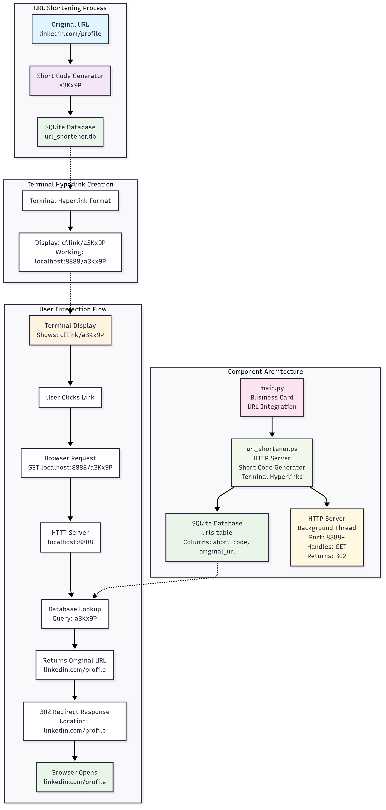
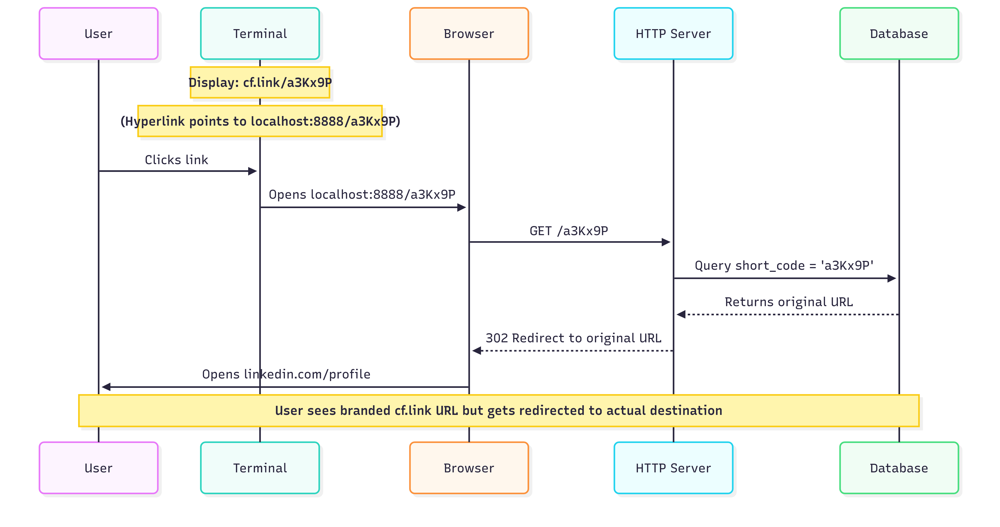

# URL Shortener - Technical Guide

## Overview

The Corefinder project is a digital business card CLI application that includes a sophisticated URL shortening system. The URL shortener serves two main purposes:
1. **Display Enhancement**: Show branded short URLs (cf.link) in the terminal while maintaining functionality
2. **Clickable Links**: Create terminal hyperlinks that work in modern terminals

## How Short URL Mapping Works

### Core Architecture

The URL shortening system consists of three main components:

1. **SQLite Database Storage** (`url_shortener.db`)
2. **HTTP Redirect Server** (runs on localhost:8888+)
3. **Terminal Hyperlink Generation**

### Database Schema

```sql
CREATE TABLE urls (
    id INTEGER PRIMARY KEY,
    original_url TEXT NOT NULL,
    short_code TEXT NOT NULL UNIQUE
)
```

### URL Mapping Process

#### 1. Short Code Generation

```python
def generate_short_code(self, length=6):
    characters = string.ascii_letters + string.digits
    while True:
        short_code = ''.join(random.choice(characters) for _ in range(length))
        if not self.get_original_url(short_code):  # Ensure uniqueness
            return short_code
```

- Generates random 6-character codes using letters and digits (62^6 = ~56 billion combinations)
- Checks database for uniqueness to prevent collisions
- Examples: `a3Kx9P`, `mN8qR2`, `pL4vB7`

#### 2. URL Storage & Retrieval

```python
def get_original_url(self, short_code):
    conn = sqlite3.connect(self.db_name)
    cursor = conn.cursor()
    cursor.execute('SELECT original_url FROM urls WHERE short_code=?', (short_code,))
    result = cursor.fetchone()
    conn.close()
    return result[0] if result else None
```

**Mapping Example:**
- Original URL: `https://www.linkedin.com/in/soumyajit-basu/`
- Short Code: `a3Kx9P`
- Database stores: `(1, 'https://www.linkedin.com/in/soumyajit-basu/', 'a3Kx9P')`

#### 3. HTTP Redirect Server

The system runs a background HTTP server that handles redirects:

```python
def do_GET(self):
    short_code = self.path.lstrip('/')  # Extract code from URL path
    original_url = self.url_shortener.get_original_url(short_code)
    
    if original_url:
        self.send_response(302)  # HTTP 302 Redirect
        self.send_header('Location', original_url)
        self.end_headers()
    else:
        self.send_response(404)  # Not Found
```

**Redirect Flow:**
1. User visits: `http://localhost:8888/a3Kx9P`
2. Server extracts short code: `a3Kx9P`
3. Database lookup returns: `https://www.linkedin.com/in/soumyajit-basu/`
4. Server sends HTTP 302 redirect to original URL
5. Browser automatically follows redirect

### Terminal Hyperlinks with Display Branding

The most sophisticated feature is creating terminal hyperlinks that show branded URLs but function with localhost:

```python
def create_terminal_link(self, original_url):
    short_code = self.generate_short_code()
    
    # Store in database
    conn.execute('INSERT INTO urls (original_url, short_code) VALUES (?, ?)', 
                 (original_url, short_code))
    
    # Create URLs
    working_url = f"http://{self.host}:{self.port}/{short_code}"      # localhost:8888/a3Kx9P
    display_url = f"http://{self.display_host}/{short_code}"          # cf.link/a3Kx9P
    
    # Return terminal hyperlink
    return f"\033]8;;{working_url}\033\\{display_url}\033]8;;\033\\"
```

**Terminal Hyperlink Format:**
- `\033]8;;URL\033\\DISPLAY_TEXT\033]8;;\033\\`
- **URL**: `http://localhost:8888/a3Kx9P` (actual link destination)
- **DISPLAY_TEXT**: `http://cf.link/a3Kx9P` (what user sees)

### Usage in Business Card

In `main.py`, URLs are enhanced when the shortener is available:

```python
"linkedin_profile": url_shortener.create_terminal_link(
    "https://www.linkedin.com/in/soumyajit-basu/"
) if url_shortener else "https://www.linkedin.com/in/soumyajit-basu/"
```

**Result:**
- Terminal displays: `http://cf.link/a3Kx9P` (branded, short)
- Click behavior: Opens `https://www.linkedin.com/in/soumyajit-basu/` (original)

### Server Management

#### Automatic Port Selection

```python
ports_to_try = [self.port, self.port + 1, self.port + 2, 9000, 9001, 9002]
```

If port 8888 is busy, automatically tries alternative ports.

#### Lifecycle Management

- **Startup**: Background thread starts HTTP server
- **Runtime**: Server handles redirects for 60 seconds (or indefinitely with `--daemon`)
- **Shutdown**: Graceful cleanup with `atexit` handler

### Thread Safety

The system handles concurrent access safely:
- **Database**: Each lookup creates a new SQLite connection
- **Server**: Runs in background daemon thread
- **Generation**: Short code uniqueness checked before insertion

### Error Handling & Graceful Degradation

If URL shortener fails to initialize:
- Application continues without shortened URLs
- Original URLs displayed instead of hyperlinks
- No server resources consumed

## Example Complete Flow

1. **Application Start**: `URLShortener(port=8888, display_host='cf.link')`
2. **Server Start**: HTTP server launches on localhost:8888
3. **URL Processing**: LinkedIn URL → short code `a3Kx9P` → database storage
4. **Display**: Terminal shows clickable `http://cf.link/a3Kx9P`
5. **User Click**: Terminal opens `http://localhost:8888/a3Kx9P`
6. **Redirect**: Server responds with 302 to original LinkedIn URL
7. **Browser**: Opens actual LinkedIn profile

### Visual Flow Diagram



#### Sequence Diagram: Complete User Flow



## Implementation Files

- **`app/url_shortener.py`**: Core URL shortening logic, HTTP server, and database management
- **`app/main.py`**: Integration with business card display and server lifecycle
- **`tests/test_redirect.py`**: URL shortener functionality tests
- **`tests/debug_shortener.py`**: Step-by-step debugging and verification

This elegant system provides professional branding while maintaining full functionality through local HTTP redirects and database persistence.

## Technical Benefits

- **Zero External Dependencies**: Uses only Python standard library
- **Thread-Safe**: Concurrent access handled properly
- **Graceful Degradation**: Works even if server fails to start
- **Professional UX**: Branded URLs with full functionality
- **Cross-Platform**: Works on Windows, macOS, and Linux

